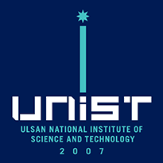
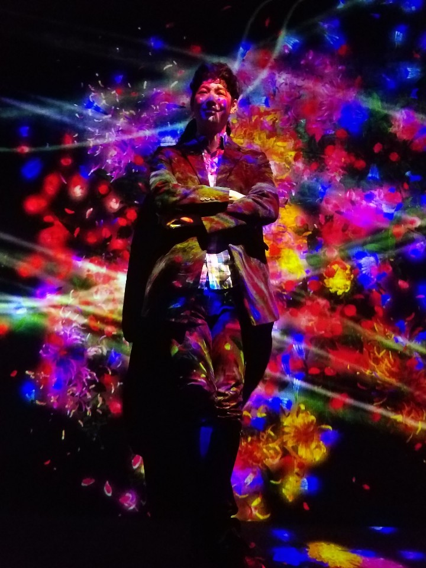

Move to <a href="../Handy/introduction/">Introduction</a>  
Move to <a href="../Handy/visualanalytics/">visual analytics</a>

# Hi, I am Dongyun Han
He is a Ph.D. student in the department of Computer Science at North Carolina A&T, NC, USA. He graduated from the UNIST(Ulsan National Institute of Science and Technology), with master and bachelors degree in Computer Science in 2020 and 2018 each. After graduation, he is currently working on a Doctor of Philosophy in Computer Science at North Carolina A&T. His research topic is HCI, especially on Data Visualization and Virtual Reality.

My formal CV is <a href="source/DongyunHan_Resume.pdf"> here </a> (expected to update)

 
Mail Address: [dhan@aggies.ncat.edu](mailto:dhan@aggies.ncat.edu) | [dyhan113@gmail.com](mailto:dyhan113@gmail.com)  
Webpage : [dongyunhan.github.io/Handy/](https://dongyunhan.github.io/Handy/)  
Github : [github.com/DongyunHan](https://github.com/DongyunHan/)  

<!-- Phone: +1-336-554-1087 / +82-10-5773-6408 -->

<!--   -->
<!--
## Research Interests

---

#### HCI (Especially on VR & AR)

#### Information Visualisation and Visual Analytics

 

## Education

---

<h4> North Carolina Agricultural and Technical State University, NC, USA</h4>

Ph.D. in, Computer Science  
Jan.' 2020 - Present

<h4> Ulsan National Institute of Science and Technology, Ulasn, Republic of Korea </h4>

Master in, Computer Science  
March’ 2018 - Feb.' 2020 (expected to graduate)

<h4> Ulsan National Institute of Science and Technology, Ulasn, Republic of Korea </h4>

Bachelor in, Electrical and Computer Engineering  
March’ 2010 - February’ 2018 (including 2 years for Military Service in the Air force)

 
## Research Experience
-----

#### **Internship** at Interactive Visual Analysis & Data Exploration Reasearch Lab, UNIST  

- Supervisor : Prof. Sung-Ahn Ko and Prof. Young-Woo Park, UNIST
- Period: June ’17 - Dec. ’17
- Submit to HCI Korea ’18 Creative Award
- Cooperated with a design background student
- Built a concept of AR device to show how many fine dusts exist in the air intuitively
  OK, Developers, Now you can design: An Interactive feedback-based Mobile GUI Prototyping Tool

#### **Intership** at High-performance Visual Computing Lab, UNIST  

- Supervisor : Prof. Won-Ki Jeong, UNIST
- Period: Nov. ’12 - February ’13
- Research about _"Reconstructing Perpendicular Images from Multi-Scale Images of the Brain"_
- Down sampled images from set of several parallel cross-sectional images of the brain in high resolu- tion, reconstruct the perpendicular images in clear resolution

#### **Internship** at Biomathematics Lab, UNIST.  

- Supervisor : Prof. Chang-Hyeong Lee, UNIST
- Period: March ’12 - May ’12
- Present Poster about **_"Representing Diagram for How MERS-CoV is Spreaded"_**
- Represented a diagram how infectees will be infected,cured or died by describing each nodes for possible states of infectees and each links for percentage of change from state A to state B

<!--
Supervisor : Prof. Sung-Ahn Ko, UNIST June ’18 - Sep.’18
- Under Submitting to ACM UIST ’19 as the third author
- Interviewed with 16 novice developers to understand their problems with an existing tool
- Built a mobile GUI prototyping tool in Google Extension that provides instant feedback on users design -->
<!--
## Awards & Achievements

---

- Awarded the Creative Award for design work presentation at HCI KOREA ’18
- Registered patent application named ’Visualization Apparatus for Displaying Fine Dust’ as patent number 18-83657

## Computer Skills

---

- **Languages:** Python, C#, HTML, JavaScript, Ajax, ...
- **Technologies:** Keras, Flask, MongoDB, ... -->

## Personal Information

---

- **Date of Birth:** 09/25/1991  
- **Nationality:** Republic of Korea  
- **Available Languages:** Native Korean, Intermediate English, Fluent Japanese, Basic Chinese

---

<!-- For full documentation visit [mkdocs.org](https://mkdocs.org).

## Commands

* `mkdocs new [dir-name]` - Create a new project.
* `mkdocs serve` - Start the live-reloading docs server.
* `mkdocs build` - Build the documentation site.
* `mkdocs help` - Print this help message.

## Project layout

    mkdocs.yml    # The configuration file.
    docs/
        index.md  # The documentation homepage.
        ...       # Other markdown pages, images and other files. -->
