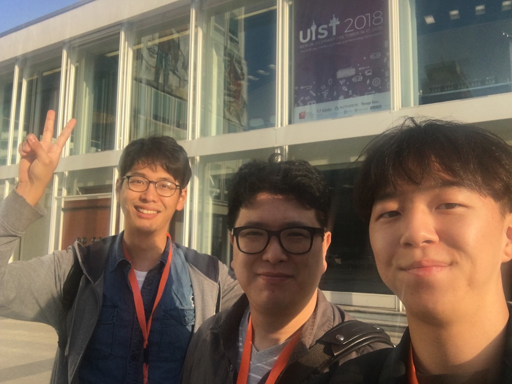

# :fa-thumbs-up: Hello, I am Dongyun Han

<!-- <i class="far fa-hand-point-right"></i> -->

He is a Ph.D. student in the department of Computer Science at North Carolina A&T, NC, USA. He graduated from the UNIST(Ulsan National Institute of Science and Technology), with master and bachelors degree in Computer Science in 2020 and 2018 each. After graduation, he is currently working on a Doctor of Philosophy in Computer Science at North Carolina A&T. His research topic is interactive visual analytics, and virtual and artificial reality (VR & AR).

- My formal CV is <a href="source/DongyunHan_Resume.pdf"> here </a>
- Mail Address: [dhan@aggies.ncat.edu](mailto:dhan@aggies.ncat.edu) | [dyhan113@gmail.com](mailto:dyhan113@gmail.com)  

<!-- Webpage : [dongyunhan.github.io/Handy/](https://dongyunhan.github.io/Handy/)   -->
<!-- Github : [github.com/DongyunHan](https://github.com/DongyunHan/)   -->

## :fa-gamepad: Research Interesting & Programming Skills

---

- **Research Interesting:** Interactive Visual Analytics, and Virtual and Artificial Reality (VR \& AR)
- **Languages:** Python, Javascript, HTML, CSS/SASS, NoSQL, C#
- **Technologies and Frameworks:** Flask, Keras, React, Express, jQuery, Unity

<!-- Phone: +1-336-554-1087 / +82-10-5773-6408 -->

## :fa-paw: Personal Information

---

- **Date of Birth:** 09/25/1991  
- **Nationality:** Republic of Korea  
- **Available Languages:** Native Korean, Intermediate English, Fluent Japanese

---

 

<!-- For full documentation visit [mkdocs.org](https://mkdocs.org).

## Commands

* `mkdocs new [dir-name]` - Create a new project.
* `mkdocs serve` - Start the live-reloading docs server.
* `mkdocs build` - Build the documentation site.
* `mkdocs help` - Print this help message.

## Project layout

    mkdocs.yml    # The configuration file.
    docs/
        index.md  # The documentation homepage.
        ...       # Other markdown pages, images and other files. -->
